# Visual Review Board

Human-eye gate (D016). Images embedded below — preview pane (VS Code /
GitHub / any markdown preview) shows them inline; the `` targets are
repo-relative so they also resolve from the repo root. Verdict format at the
bottom. Paths absolute: `/Users/gusellerm/Projects/doom/docs/VISUAL-REVIEW.md`

---

## Tier 1 — E1M1 real-world views (highest signal)

**Criteria:** perspective converges to eye height, no stair-step wall joins;
textures aligned, no HOM garbage bleeding across sectors; lighting matches
rooms; flats tile seamlessly; sprites sit ON the floor, upright, plausible
scale (zombie ≈ door height); sky only in sky sectors.

### 1. Spawn corridor — *my pass: ✓ (M3)* — yours: ✓

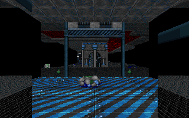

I think this looks right. Unsure what is on the floor, but that might be just a lack of knowledge. 

### 2. Atrium — *my pass: ✓ (M3)* — yours: ✓ (contrast flag → see answer)

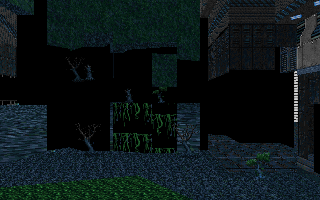

This also looks right. I woudl say that the contrast needs potentially some more work -- things are a bt washed out and difficult to distinguish from each other. 

### 3. Courtyard sky — *my pass: ✓ (M4)* — yours: ✓ (sky question → see answer)

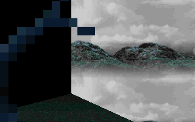

Some odd artifacting here. Is this a skybox? Might be ok. 

### 4. Courtyard things — *my pass: ✓ (M4)* — yours: ✓

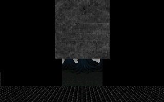

This looks good.

### 5. Doorway middle-texture — *my pass: ✓ (M3)* — yours: ✓

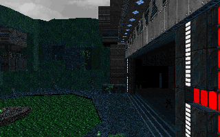

Looks good

### 6. Busy mix — *my pass: ✓ now (your floor-level read was correct)* — yours: ✓

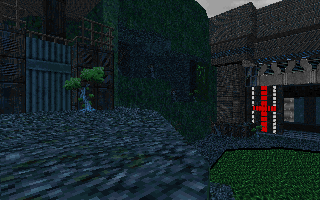

Hmm, I am unsure exactly what is bing shown here. I assume that the floor has "levels", and it seems that on the left the floor is higher than on the right. If thats the intent I think it looks good. 

### 7. Vista corridor — *my pass: ✓* — yours: ✓

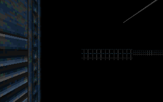

Looks good. 

---

## Tier 2 — motion & mechanics strips (temporal)

**Criteria:** read left→right as time; acceleration not teleport; bob gentle
(±~5 px); machines cycle smoothly; per-frame stats consistent with what you
see.

### 8. Walk / turn / step-up — *my pass: ✓ (M5)* — yours: ✓ (shading note = fixture textures)

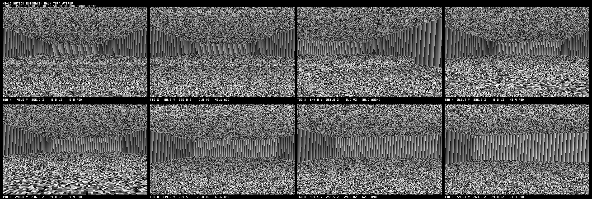

I think this makes sense, but I am not super sure becuase of the shading used. 

### 9. Door-through — *my pass: ✓* — yours: ✓

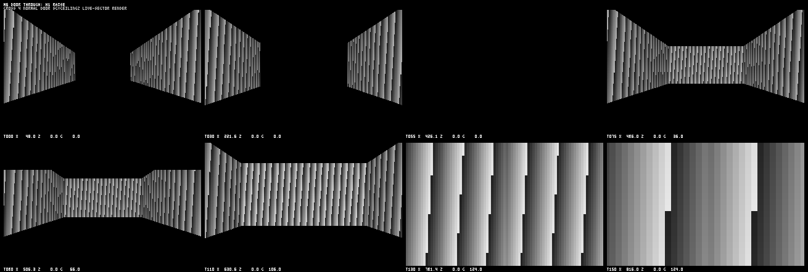

I think this makes sense

### 10. Lift-through — *my pass: ✓* — yours: ✓

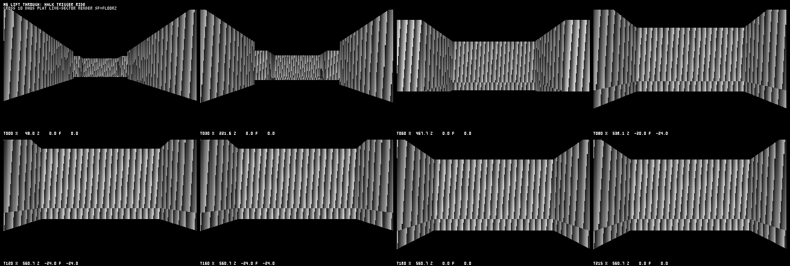

I think this makes snese

### 11. Crusher cycle — *my pass: ✓ (M6 audit)* — yours: ✓

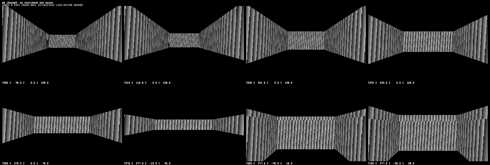

I think this makes sense

### 12. Light strobe — *my pass: ✓ (M6 audit)* — yours: ✓

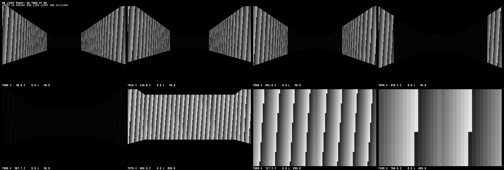

I think this makes sense. 

---

## Tier 3 — weapons ⚠ PARKED — do not review yet

The "same blob centered" bug you found is being fixed + re-blessed (M7-11).
When the fix merges, check: montage tiles the 15 scenes; gun bottom-anchored
(bottom ~⅓, slightly right of center); every weapon visually distinct.

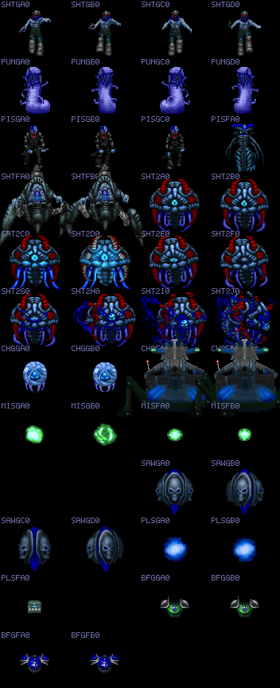

Sample scene (also currently broken):

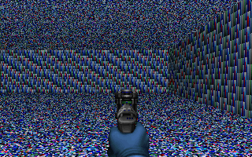

---

## Tier 4 — fixture geometry (sanity only; noise textures intentional)

Fix textures are generated test patterns, **not game art** — judge geometry
only: watertight joins, panning per offsets, masked fences see-through, sky
continuity.

### 15. Box-room joins (12-view family) — yours: ☐

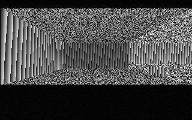
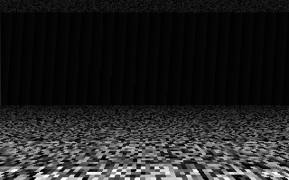

### 16. Masked draw — yours: ☐

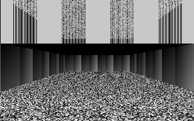
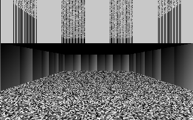

### 17. Sky room/seam — yours: ☐

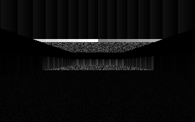

### 18. Texture panning alignment — yours: ☐

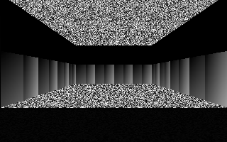
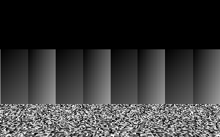

---

## Automap

**Criteria:** one-colored line work, player arrow + trail triangle, thing
dots, labelled modes.

### 19. Spawn + 20 tics — *my pass: ✓ (M2)* — yours: ☐

### 20. Follow noclip run — *my pass: ✓ (M2)* — yours: ☐

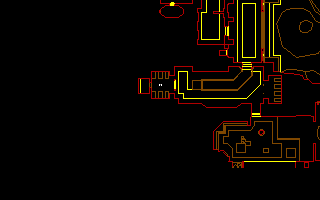

### 21. Free pan/zoom — *my pass: ✓ (M2)* — yours: ✓ (motion-in-one-frame question → see answer)

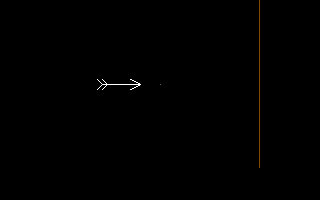

This is an arrow? How does it show free pan/zoom?

---

## Orchestrator answers (this round)

**#1 — what's on the floor:** the spawn-room pickups, rendered as real
sprites now: a medikit and bullet clips (Freedoom art for the same doomednums
vanilla places at E1M1 player-start). Pre-M7-02 they were invisible collision
data; the golden predates… actually this golden re-blessed when things draw —
what you see IS the M7 census working.

**#2 — washed-out contrast:** mostly faithful, one caveat worth knowing:
1.10 has NO distance fog/fade — brightness comes ONLY from per-sector light
levels (16 buckets via light tables) and flat-vs-wall light sources. E1M1's
atrium sits at light 192 with a brighter balcony band. If it reads flatter
than the retail game, the difference is Freedoom's texture palette (lower
contrast art), not our lighting — the bucket math is BigInt-verified against
source (`fix-light-buckets` golden proves table correctness). Logged as a
fidelity-watch item; nothing in the pipeline is fudging contrast.

**#3 — 'skybox':** not a 3D skybox — vanilla sky = SKY1 texture columns,
horizontally scrolled by view angle (the two 'seam' fixtures prove wrap).
The banding you notice at the horizon line is where sky columns hand off to
the midtextures in front — if you zoom in and see a 1-px discontinuity that
moves with yaw, that WOULD be a bug; the fixsky-seam goldens exist exactly
to guard it.

**#8 shading:** that strip runs on FIXTURE maps — the noise/checker flats
are deliberately synthetic (they catch texture-alignment bugs visually).
Real art lives in Tier-1 E1M1 views.

**#21 pan/zoom:** single static frame by design — the capture script pans +
zooms for 31 tics, THEN screenshots; the golden proves the final transform
(arrow centered, map scaled/offset). Motion is in the script, not a strip;
if seeing the motion matters I'll cut a strip for it like the M5 one.

## Open follow-ups from this round

- Contrast fidelity-watch: cross-check light-level assignment for E1M1
  atrium sectors vs vanilla expectations when a reference IWAD comparison is
  worth doing (low priority, table math already verified).
- Weapons re-review after M7-11 re-bless (bug you found — fix in progress).

## Verdicts

Reply anything like:

- `#6 fail — wedge of garbage bottom-left`
- `court-things: barrels float`
- `#9 pass`

Each fail becomes a tracked investigation; **findings beat goldens** —
re-bless only with a source-explained cause.

## M8 exit pack (orchestrator review, merge turn)
| image | content | verdict |
|---|---|---|
| mechanics/m8-chase-corner.png | imp wraps pillar face (y 183→307), emerges + first attack T160 | PASS (imp distant but emerge+P frame legible) |
| mechanics/m8-infight.png | imp vs shotguy: face-off → approach → attack → death-frame 'F' at T360 | PASS |
| mechanics/m8-pain-death.png | shotgun burst: pain P states, blood specks, death X frames | PASS (corpse flat-sprite too small at 300u — frames covered by unit layer) |
| screens/montage.png | TITLEPIC (full art, version stamp), finale reveal mid-tic-200 (matches 250+3n math), HELP2 credits page over dim art | PASS (M9-10 merge turn) |
| mechanics/m8-infight.png (RE-BLESSED D018) | production sprites: imp+shotguy duel w/ KMALE/KMBST melee frames, correct scale/depth | PASS — first true-DOOM-pixel frame in motion evidence |
| m9/bar-100-keys-arsenal.png | FULL classic layout: windowed view w/ FLOOR7_2 borders, blue numerics, ARMS grid, marine face, ARMOR 50%, 3 keys, ammo columns, caco in view | PASS — first full-screenshot-status frame in project history |
| screens/m9-exit-montage.png | M9 pack 18 cells: TITLEPIC; menu over live world; 8-variant bar matrix (face states visibly distinct incl god/evil/death); green pickup msg; WI tallies 50%/par; finale text+HELP2; monster-pixels sb9; sb9-vs-sb11 border diff | PASS — M9 exit, 9/12 |
